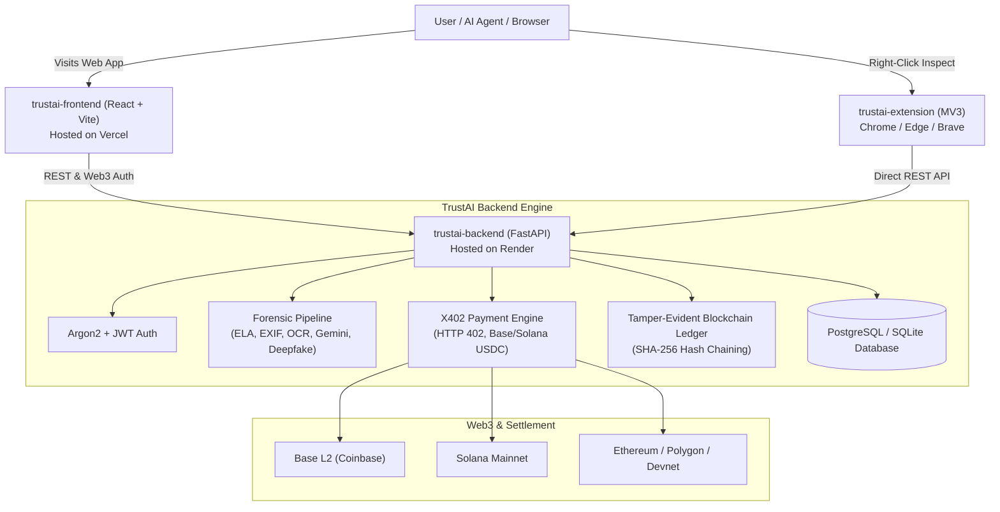

# TrustAI — Multi-Layer Media Forensics & Web3 Verification Platform

[](https://vercel.com)
[](https://render.com)
[](https://fastapi.tiangolo.com)
[](https://reactjs.org)
[](https://x402.org)
[](LICENSE)

**TrustAI** is an end-to-end platform for detecting AI-generated media, image manipulation, and document forgery. It combines multi-layer forensic analysis (EXIF metadata, Error Level Analysis heatmaps, OCR layout forensics, Gemini vision heuristics, and deepfake screening), an immutable local blockchain audit ledger, and the open **X402 Web3 payment protocol** for instant machine-to-machine and wallet micropayments.

---

## Architecture Overview



---

## Monorepo Components

| Folder | Technology | Purpose | Production Target |
|---|---|---|---|
| [`trustai-frontend/`](file:///c:/Users/khana/Downloads/trustai21st/trustai/trustai-frontend) | React 18, Vite, TailwindCSS, Web3 | Client dashboard, verification studio, Web3 wallet connector, and interactive ELA overlays | **Vercel** |
| [`trustai-backend/`](file:///c:/Users/khana/Downloads/trustai21st/trustai/trustai-backend) | FastAPI, Python 3.10+, SQLAlchemy, OpenCV | Forensics pipeline, X402 payment protocol, blockchain audit ledger, and authentication | **Render** |
| [`trustai-extension/`](file:///c:/Users/khana/Downloads/trustai21st/trustai/trustai-extension) | Manifest V3, JavaScript | Browser extension for 1-click right-click media & document verification on any website | **Chrome Web Store / Unpacked** |

---

## Quickstart (Run Locally in 2 Minutes)

### 1. Prerequisites
- **Node.js**: v18 or higher
- **Python**: 3.10 or higher
- **Git**

### 2. Start the Backend
Open a terminal:
```bash
cd trustai-backend

# 1. Create and activate virtual environment
python -m venv .venv
# On Windows:
.venv\Scripts\activate
# On macOS/Linux:
source .venv/bin/activate

# 2. Install dependencies
pip install -r requirements.txt

# 3. Configure environment
cp .env.example .env

# 4. Start backend server
uvicorn app.main:app --reload --host 0.0.0.0 --port 8000
```
- Backend API runs at `http://localhost:8000`
- Interactive Swagger docs at `http://localhost:8000/docs`

### 3. Start the Frontend
Open a second terminal:
```bash
cd trustai-frontend

# 1. Install dependencies
npm install

# 2. Configure environment
cp .env.example .env

# 3. Start Vite dev server
npm run dev
```
- Frontend runs at `http://localhost:5173`

### 4. Load the Browser Extension (Optional)
1. In Chrome / Brave / Edge, open `chrome://extensions`.
2. Toggle on **Developer mode** (top right).
3. Click **Load unpacked** and select the `trustai-extension/` directory.
4. Right-click any image or PDF on the web and select **Check with TrustAI**.

---

## Deployment Guide

### Deploying the Frontend on Vercel

1. Push your repository to **GitHub**.
2. Go to [Vercel](https://vercel.com) and click **Add New...** -> **Project**.
3. Select your repository.
4. Configure the build settings:
   - **Framework Preset**: `Vite`
   - **Root Directory**: `trustai-frontend`
   - **Build Command**: `npm run build`
   - **Output Directory**: `dist`
5. Add the Environment Variable:
   - `VITE_API_BASE_URL`: `https://your-backend-service.onrender.com`
6. Click **Deploy**.

> `trustai-frontend/vercel.json` is pre-configured with SPA route rewrites and security headers so client-side routes (`/check`, `/pricing`, `/checkout`, `/wallet`, `/subscription`) reload without 404 errors.

---

### Deploying the Backend on Render

#### Option A: Using the Render Blueprint (`render.yaml`) — Recommended
1. In the [Render Dashboard](https://dashboard.render.com), click **New** -> **Blueprint**.
2. Connect your GitHub repository.
3. Render automatically discovers `render.yaml` and provisions `trustai-backend`.

#### Option B: Manual Web Service Setup
1. In Render Dashboard, click **New** -> **Web Service**.
2. Select your repository.
3. Configure settings:
   - **Name**: `trustai-backend`
   - **Root Directory**: `trustai-backend`
   - **Runtime**: `Python 3` (or `Docker`)
   - **Build Command**: `pip install --upgrade pip && pip install -r requirements.txt`
   - **Start Command**: `uvicorn app.main:app --host 0.0.0.0 --port $PORT`
   - **Health Check Path**: `/health`
4. Add the following Environment Variables in the Render dashboard:
   - `PYTHON_VERSION`: `3.10.12`
   - `PUBLIC_BASE_URL`: `https://your-backend-name.onrender.com`
   - `JWT_SECRET_KEY`: *(Generate a secure random string)*
   - `CORS_ORIGINS`: `https://your-frontend.vercel.app,http://localhost:5173`
   - `X402_MERCHANT_ADDRESS`: `0x71C8366420A0926793fe14b17bEE06941866420A`
5. Click **Create Web Service**.

---

## Environment Variables Matrix

| Variable | Description | Backend / Frontend | Default / Example |
|---|---|---|---|
| `VITE_API_BASE_URL` | Backend URL for API calls | Frontend | `http://localhost:8000` |
| `PUBLIC_BASE_URL` | Base URL used to build file preview links | Backend | `http://localhost:8000` |
| `DATABASE_URL` | SQLite or PostgreSQL connection string | Backend | `sqlite:///./trustai.db` |
| `JWT_SECRET_KEY` | Secret key for signing auth tokens | Backend | *(32+ char random string)* |
| `CORS_ORIGINS` | Comma-separated or JSON list of allowed origins | Backend | `["http://localhost:5173"]` |
| `X402_MERCHANT_ADDRESS` | Merchant recipient crypto wallet address | Backend | `0x71C8366420A0926793fe14b17bEE06941866420A` |
| `X402_DEFAULT_NETWORK` | Default blockchain settlement network | Backend | `eip155:8453` (Base L2) |
| `RAZORPAY_KEY_ID` | Optional Razorpay Key ID for fiat payments | Backend | *(optional)* |
| `GEMINI_API_KEY` | Optional Google Gemini Key for visual forensics | Backend | *(optional)* |
| `SIGHTENGINE_API_USER` | Optional Sightengine user for deepfake check | Backend | *(optional)* |

---

## Testing & Validation

Run the automated backend test suite (testing X402 challenge, signature settlement, database tier updates, and blockchain audit receipts):
```bash
cd trustai-backend
python test_x402_integration.py
```

Run frontend build validation:
```bash
cd trustai-frontend
npm run build
```

---

## License

This project is licensed under the MIT License — see the [LICENSE](LICENSE) file for details.
